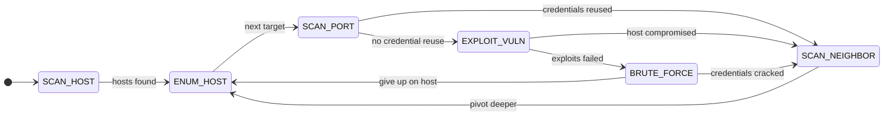

# MTDSim

A discrete-event simulator for evaluating **Moving Target Defence (MTD)**.

MTD starts from the assumption that a static network will eventually fall, so the
defence keeps moving the attack surface (reassigning IP addresses, diversifying
operating systems, rewiring topology) to invalidate whatever the attacker has
already learned. MTDSim runs that contest in simulated time: an attacker works
through a generated enterprise network while MTD strategies fire on their own
schedule, and both sides pay for what they do.

Attacker actions and MTD operations are [SimPy](https://simpy.readthedocs.io/)
processes with durations, so the interesting behaviour is in the interleaving: a
mutation landing mid-exploit costs the attacker its progress, while one firing
where the attacker is not costs the defender the disruption for nothing. A given
seed reproduces a run exactly.

## Install

With [conda](https://conda.io):

```sh
conda env create -f environment.yml
conda activate mtdsim
```

Or a plain virtual environment (Python ≥ 3.10):

```sh
python3 -m venv .venv && source .venv/bin/activate
pip install -e .[test]
```

The optional reinforcement-learning MTD selector needs TensorFlow (`pip install -e .[ai]`).

## Watch a run happen

The quickest way to understand the simulator is to watch one contest unfold.
`mtdsim.trace` prints every event in simulated-time order, colour-coded by actor,
and then scores the run:

```sh
python -m mtdsim.trace --scheme none                  # the attacker, unopposed
python -m mtdsim.trace --scheme simultaneous          # the same attacker, defended
```

```
  t=     35.0  ATTACKER    EXPLOIT_VULN   host 0: trying 15 vulnerabilities
  t=     80.8  MUTATION    OSDiversity: hosts are running different operating systems
  t=     80.8  INTERRUPT   CAUGHT         OSDiversity hit the attacker mid-EXPLOIT_VULN
  t=    102.1  INTERRUPT   SETBACK        attacker confused for 21.3 t/u
  t=    110.6  MUTATION    CompleteTopologyShuffle: the network has been rewired end to end
  t=    110.6  INTERRUPT   CAUGHT         CompleteTopologyShuffle hit the attacker mid-SCAN_PORT
  t=    130.8  INTERRUPT   SETBACK        attacker confused for 20.2 t/u
  t=    375.1  COMPROMISE  FOOTHOLD       host 0 compromised — the attacker is in
```

Run both at the same seed and the point of MTD is visible directly: the attacker
takes its first host much later when the defence is running, because it keeps
being thrown off a host it had nearly taken. The closing verdict scores that —
whether the attacker struggled for a foothold, how often mutations landed on it
rather than firing into empty air, and how much of the run it spent confused
rather than working.

Useful flags: `--only attacker,compromise` filters the stream, `--quiet` gives the
verdict alone, `--no-colour` writes to a file. `--help` lists the rest.

## Run an experiment

```sh
python -m mtdsim.run                                # random scheme, defaults
python -m mtdsim.run --scheme none                  # undefended control
python -m mtdsim.run --scheme single --mtd IPShuffle
python -m mtdsim.run --scheme alternative --mtd IPShuffle --mtd OSDiversity
python -m mtdsim.run --finish-time 0                # stop at the compromise threshold
python -m mtdsim.run --nodes 100 --seed 42
```

Each run writes to `output/<scheme>/`: `summary.json` (parameters, results, metric
checkpoints), `attack_record.csv` and `mtd_record.csv` (every event with its start
and duration), and PNGs of the topology and event timelines.

Always run an undefended control at the same seed — a defended run is only
interpretable against what the attacker managed unopposed.

## The model

### Network

Generated as a **Hierarchical Attack Representation Model (HARM)**:

| Layer | What it is |
|---|---|
| Network | Hosts in a layered graph. A few are internet-facing **exposed endpoints**; the rest sit in deeper subnets, databases deepest. |
| Host | An operating system and a set of services. It falls when an internal service falls, or when its credentials are stolen. |
| Service | An attack tree of vulnerabilities, each with a complexity and an impact. The service is compromised once the summed impact of exploited vulnerabilities crosses a threshold. |

Users reuse passwords across hosts with some probability, which is what gives
credential attacks and `UserShuffle` something to bite on.

### Attacker

A fixed penetration-testing loop, each action costing simulated time:



`SCAN_HOST` 5 · `ENUM_HOST` 5 · `SCAN_PORT` 25 · `EXPLOIT_VULN` 15 per
vulnerability · `BRUTE_FORCE` 20 · `SCAN_NEIGHBOR` 5.

Three rules shape the dynamics: the attacker abandons a host after 10 failed
attempts, a compromised host stays compromised, and a mutation catching it
mid-action costs it a confusion penalty (mean 20) plus its position. It restarts
at `SCAN_HOST` after a network-layer mutation (address and route knowledge void)
or at `SCAN_PORT` after an application-layer one (it still holds the host, but not
what it knew about the services on it).

### Defender

Eight strategies, each tagged with the layer it disrupts (which decides how far
back it throws the attacker):

| Strategy | Layer | Moves |
|---|---|---|
| `CompleteTopologyShuffle` | network | regenerates the topology |
| `HostTopologyShuffle` | network | swaps host positions |
| `IPShuffle` | network | reassigns IP addresses |
| `OSDiversity` | application | re-rolls operating systems |
| `OSDiversityAssignment` | application | OS assignment by diversity-maximising optimisation |
| `ServiceDiversity` | application | re-rolls service versions |
| `PortShuffle` | application | reassigns service ports |
| `UserShuffle` | application | reassigns user accounts |

A **scheme** decides which fire and when, on intervals drawn around a mean rather
than fixed: `none` (undefended), `single` (one chosen strategy), `random` (one
from the pool each interval), `alternative` (round-robin), `simultaneous` (the
whole pool at once), and `mtd_ai` (a DQN selector reading live network state;
needs the `[ai]` extra and a trained model).

Mutations hold the network or application resource while they run, so concurrent
operations queue. Firing everything at once has a cost, which is the trade-off the
schemes exist to explore.

## Layout

```
mtdsim/
  component/    network generation, hosts, services, the adversary
  data/         constants and wordlists
  mtd/          the eight strategies
  mtdai/        DQN-based selection (optional)
  operation/    the SimPy attack and MTD processes
  snapshot/     save/restore of network and adversary state
  statistic/    per-run records and evaluation metrics
  run.py        run an experiment
  trace.py      watch one run event by event
tests/          regression tests for previously broken invariants
```

Run the tests with `pytest`.

## Lineage

MTDSim comes from a series of UWA engineering honours projects: Brown et al. built
the foundational simulator (2021), Zhang moved it into the time domain with the
execution schemes and MTTC evaluation (MTDSimTime, 2023), and Ho and Tay added the
metric suite and the reinforcement-learning selector (2024). This repository
continues from [Bsubs/MTDSim](https://github.com/Bsubs/MTDSim), with the
simulation core repaired, the package renamed to `mtdsim`, and modern packaging.
The students' theses are in the upstream repository's `docs/`.

Several defects in the inherited core have been fixed here, the most consequential
being that vulnerability objects were shared between hosts, so exploiting one host
marked that vulnerability exploited on every host carrying it. Compromise spread
without the attacker doing anything, which suppressed the measured effect of every
MTD strategy. The regression tests in `tests/` pin these invariants; if you are
comparing against published MTDSim numbers, expect this version to report a
stronger defensive effect.
