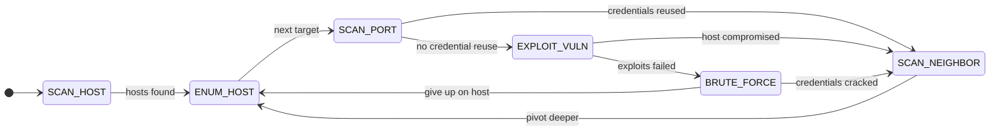

# MTDSim

A time-based, discrete-event simulator for evaluating **Moving Target Defence (MTD)** techniques.

MTD assumes the attacker will eventually get in if the network stands still, so the defence keeps changing the attack surface — shuffling IP addresses, diversifying operating systems, rewiring topology — to invalidate what the attacker has already learned. MTDSim simulates that contest: a simulated attacker works through a generated enterprise network while MTD strategies fire on their own schedule, and the simulator measures who is winning and at what cost.

What distinguishes it from static (attack-graph-only) MTD analysis:

- **Time domain.** Attacker actions and MTD operations are [SimPy](https://simpy.readthedocs.io/) processes with durations and variance, so interleaving and interruption matter — an MTD that fires mid-exploit sets the attacker back, one that fires too rarely does nothing, one that fires too often degrades the network for its users.
- **Both sides modelled.** The attacker adapts to the defence (re-scanning after a shuffle); the defence contends for network/application resources like real maintenance operations would.
- **Reproducible.** A given seed reproduces a run exactly.
- **Measured.** Every run emits per-event records and a metric suite (time to compromise, attack success rate, MTD execution frequency, attack-path exposure, return on attack, risk).

## Quick start

With [conda](https://conda.io) (installs Python 3.11 and the package, editable, in one step):

```sh
conda env create -f environment.yml
conda activate mtdsim
```

Or with a plain virtual environment (Python ≥ 3.10):

```sh
python3 -m venv .venv && source .venv/bin/activate
pip install -e .[test]
```

The optional reinforcement-learning MTD selector needs TensorFlow: `pip install -e .[ai]`.

Then run a simulation:

```sh
python -m mtdsim.run
```

## Running simulations

```sh
python -m mtdsim.run                              # random scheme, 50-host network, 3000s
python -m mtdsim.run --scheme none                # attacker only, no defence
python -m mtdsim.run --scheme single --mtd IPShuffle
python -m mtdsim.run --scheme alternative --mtd IPShuffle --mtd OSDiversity
python -m mtdsim.run --finish-time 0              # run until the compromise threshold
python -m mtdsim.run --nodes 100 --seed 42        # bigger network, different seed
```

`python -m mtdsim.run --help` lists every knob (network geometry, trigger interval, output directory).

Each run writes to `output/<scheme>/`:

| File | Contents |
|---|---|
| `summary.json` | parameters, headline results, metric checkpoints, library versions |
| `attack_record.csv` | every attacker action: name, start, duration, target host |
| `mtd_record.csv` | every MTD event: strategy, start, duration |
| `network.png` | the generated topology |
| `attack_record.png` / `mtd_record.png` | event timelines |

A quick sanity experiment — no defence versus the random scheme:

```sh
python -m mtdsim.run --scheme none --finish-time 0    # undefended: 0.8 compromise at ~6,000 s
python -m mtdsim.run --scheme random --finish-time 0  # defended: the same threshold takes ~40% longer
```

(Compare `simulated_time` in the two `summary.json` files; exact numbers depend on the seed.)

## How the simulation works

### The network — a time-based HARM

The generated network follows a **Hierarchical Attack Representation Model (HARM)**:

| Layer | Representation |
|---|---|
| Network | Hosts connected in a layered attack graph. A configurable handful are **exposed endpoints** (internet-facing); the rest sit in subnets across deeper layers, with database hosts deepest. |
| Host | An operating system plus a set of services (some internal, some externally reachable). A host falls when one of its internal services falls — or when its credentials are stolen. |
| Service | An attack tree of vulnerabilities, each with an attack complexity and an impact score. A service is compromised when the summed impact of exploited vulnerabilities crosses a threshold. |

Default geometry: 50 hosts, 5 exposed endpoints, 8 subnets, 4 layers (all adjustable from the CLI). Hosts get named users, and users reuse passwords across hosts with some probability — which is what makes credential attacks and `UserShuffle` meaningful.

### The attacker — a finite-state machine

The adversary walks a fixed penetration-testing loop, each action taking simulated time (means in seconds shown below):



`SCAN_HOST` 5 · `ENUM_HOST` 5 · `SCAN_PORT` 25 · `EXPLOIT_VULN` 15 per vulnerability · `BRUTE_FORCE` 20 · `SCAN_NEIGHBOR` 5.

Details that shape the dynamics: the attacker abandons a host after 10 failed attempts (the give-up rule); compromised hosts are backdoored and never re-attacked; and when an MTD fires mid-action the attacker pays a confusion penalty (mean 20 s), then **restarts from `SCAN_HOST`** if the MTD changed the network layer (addresses/topology no longer valid) or from `SCAN_PORT` if it changed the application layer on the current host.

### The defender — MTD strategies and schemes

Eight MTD strategies, each tagged with the resource layer it disrupts (which decides how hard it sets the attacker back):

| Strategy | Layer | Moves |
|---|---|---|
| `CompleteTopologyShuffle` | network | regenerates the whole topology |
| `HostTopologyShuffle` | network | swaps host positions |
| `IPShuffle` | network | reassigns IP addresses |
| `OSDiversity` | application | re-rolls host operating systems |
| `OSDiversityAssignment` | application | OS assignment via a diversity-maximising optimisation |
| `ServiceDiversity` | application | re-rolls service versions |
| `PortShuffle` | application | reassigns service ports |
| `UserShuffle` | application | reassigns user accounts |

A **scheme** decides which strategies fire and when (trigger intervals are drawn around a mean, not fixed):

- `none` — undefended baseline.
- `single` — one chosen strategy on a fixed mean interval (default 200 s).
- `random` — a random strategy from the pool each interval (200 s).
- `alternative` — round-robin through the pool (200 s).
- `simultaneous` — the whole pool together each interval (700 s).
- `mtd_ai` — a deep-Q-network selector that picks strategies from live network state (needs the `[ai]` extra and a trained model; see `mtdsim/mtdai/` and `mtdsim/operation/mtd_ai_*.py`).

MTD operations acquire network/application resources while they run, so concurrent operations queue — deploying everything at once has a cost, which is the trade-off the schemes explore.

## Metrics

`summary.json` reports, at each host-compromise checkpoint (10%, 20%, …): **time to compromise**, **attack success rate** (compromises per attack attempt), **MTD execution frequency**, **host compromise ratio**, **attack-path exposure**, **return on attack**, **risk**, and **shortest-path variability**. Per-event records let you compute anything else.

## Repository layout

```
mtdsim/
  component/    network generation, hosts, services, the adversary
  data/         simulation constants and wordlists
  mtd/          the eight MTD strategy implementations
  mtdai/        DQN-based MTD selection (optional, TensorFlow)
  operation/    the SimPy attack and MTD processes
  snapshot/     save/restore of network + adversary state
  statistic/    per-run records and the evaluation metrics
  run.py        the CLI entry point
tests/          regression tests for previously broken invariants
```

Run the tests with `pytest`.

## Lineage

MTDSim was developed across a series of UWA engineering honours projects: Brown et al. built the foundational simulator (2021), Zhang moved it into the time domain with the execution schemes and MTTC evaluation (MTDSimTime, 2023), and Ho and Tay added the metric suite and the reinforcement-learning MTD selector (2024). This repository continues from [Bsubs/MTDSim](https://github.com/Bsubs/MTDSim) with the simulation core repaired (see `tests/`), the package renamed to `mtdsim`, modern packaging, and this documentation; the students' theses are available in the upstream repository's `docs/`.
