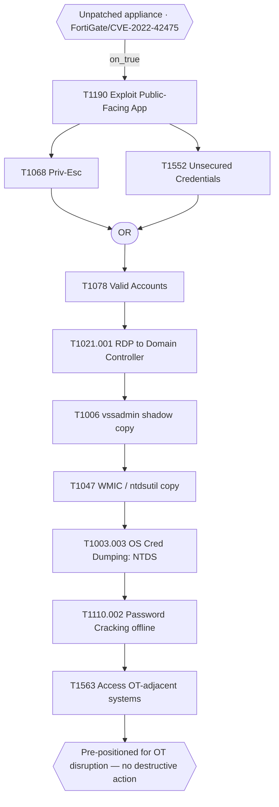

# Hand-curated Attack Flow — Volt Typhoon (CISA AA24-038A)

**Status:** durable, provenance-dated. **Created:** 2026-08-31.
**Source:** joint advisory **AA24-038A**, *PRC State-Sponsored Actors Compromise and
Maintain Persistent Access to U.S. Critical Infrastructure* — CISA, NSA, FBI, with
DOE, EPA, TSA, ASD's ACSC, CCCS, NCSC-UK, NCSC-NZ; first published **8 Feb 2024**.
Text read from the ASD's ACSC republication (`cyber.gov.au`); `cisa.gov` returns
HTTP 403 to automated retrieval. Bib key: `cisaaa24038a`.

## What this is

A **hand-authored Attack Flow of Volt Typhoon activity**, reconstructed *solely* from
AA24-038A. It is the concrete artefact behind the ch3 "Version A" plan: a real-incident
flow built **beside** the MITRE CTID corpus, so the chapter can (a) use an APT-relevant
example of the Attack Flow schema and (b) make the coverage-cost argument with the
most-reported state campaign of the decade — which the CTID corpus does **not** contain.

Files in this directory:

| file | what it is |
|---|---|
| `build_volt_typhoon_aa24038a.py` | the reproducible generator **and** the primary provenance ledger — every node carries the advisory use-sentence, every edge a `basis` note + `stated`/`inferred` tag |
| `volt_typhoon_aa24038a.json` | the STIX 2.1 Attack Flow bundle (the canonical machine form; the same four-SDO grammar the corpus flows use) |
| `volt_typhoon_aa24038a.yaml` | the per-flow extract, **produced by the repo's own parser** from the bundle (not hand-typed) — the round-trip is the fidelity proof |
| this `README.md` | the human-readable record: fidelity contract, node/edge ledger, validation, placement |
| `build_volt_typhoon_exemplar.py` | generator for the reduced **ch3 schema-exemplar** subset (below) — emits the `.afb` and a subset STIX bundle |
| `volt_typhoon_exemplar.afb` | the reduced subset as an **Attack Flow Builder** file (`attack_flow_v2`) — open in the Builder and export SVG |
| `volt_typhoon_exemplar.json` | the same subset as a STIX 2.1 bundle (parser-validated fallback) |
| `volt_typhoon_exemplar.presentation.svg` | the Builder's Presentation-mode SVG export of the `.afb` — the input to the figure restyle pipeline (below) |

Regenerate (idempotent, deterministic ids):

```sh
PYTHONPATH=src python3 data/gap/hand_curated/build_volt_typhoon_aa24038a.py
```

## It is NOT in the corpus (and why that matters)

`source: hand_curated`. The L1 build globs `data/gap/_corpus_stix/*.json` and this
file is not there, so a `python -m mtdsim.l0_cti` + rebuild does not ingest it and the
canonical `gap_v0.5.json` is unchanged. Admitting it to the corpus is a **membership
ruling reserved for Marc** (`gap_schema.md` Decision 6), with the usual L2→L3 blast
radius; it is deliberately **not** taken here. Keeping it out also preserves the GAP's
"analyst-curated, independent of the author" provenance claim. If ever admitted, it
would enter as a `hand_curated` (or labelled-overlay) input, never silently.

## Fidelity contract

1. **Technique set == advisory Appendix C (Tables 5–17).** Every technique the advisory
   formally maps is a node, at the sub-technique granularity drawn. `tactic_id` is the
   tactic of the Appendix table the technique appears under (the advisory's own mapping),
   even where ATT&CK lists the technique under several tactics. Count: **67 actions**.
   (The 68th inline tag, `T1016` parent in the C2/FRP prose, is not in Appendix C and is
   not a node.)
2. **Edges encode only advisory-stated or advisory-implied order.** 57 `stated`, 16
   `inferred`; no edge rests on analyst intuition beyond the cited text. Full ledger below.
3. **No fabricated objective.** The advisory is explicit that Volt Typhoon pre-positions
   and does **not** execute destructive action ("minimal activity … objective is to
   maintain persistence"). The terminal node is an `attack-condition` end-state, **not**
   an Impact technique. This is itself a thesis point: objective-driven restraint is an
   APT signature the flow makes visible.
4. **Speculative advisory claims are flagged in-node**, not silently promoted: the
   Azure/cloud branch (`T1021.007`, `T1078.004` — "attribution … inconclusive") and
   Pass-the-Hash/Ticket (`T1550` — "may be capable") carry the qualifier in their
   descriptions.

## The stated backbone (the advisory's own "typical activity")

```
[unpatched appliance: CVE-2022-42475 / FortiGate 300D]
        │ on_true
        ▼
recon (T1591/T1590/T1589/T1592/T1593/T1594) ─┐   exploit caps (T1588.005/T1587.004) ─┐
                                             ▼                                         ▼
                                     T1190 Exploit Public-Facing App ─── "and then connects via VPN" ──► T1133
                                             │
                                             ▼
                                     T1068 priv-esc  ──┐
                                     T1552 stored cred ─┴─(OR)─► T1078 Valid Accounts ─► LOTL discovery fan (17)
                                                                        │
                                                                        ▼
                                                            T1021.001 RDP → DC
                                                                        ▼
                                     T1006 vssadmin ─► T1047 WMIC/ntdsutil ─► T1003.003 NTDS.dit ─► T1110.002 crack offline
                                                                                                          │
                                                                                                          ▼
                                                                            T1563 access OT-adjacent (PuTTY profiles)
                                                                                                          ▼
                                                              [pre-positioned for OT disruption — no destructive action executed]
```

## ATT&CK version deltas (recorded, not silently rewritten)

The advisory maps against ATT&CK **v14**; the repo pins Enterprise **v19.1**. Faithful to
the advisory as drawn, two deltas are noted rather than edited: `T1070.001` (Clear Windows
Event Logs) is **revoked** in v19.1 (→ `T1685.005`); `TA0005` was renamed **Defense
Evasion → Stealth**. All parent-collapse targets (`T1070`, `T1003`, `T1090`, `T1021`, …)
resolve in v19.1, so the repo's Enterprise-scope check would pass on parents were the flow
ever admitted to the corpus.

## Validation (this repo's gate, not the upstream CLI)

The upstream `attack-flow` CLI (`validate`, `mermaid`) does **not** run in the `mtdsim`
conda env — its pinned `stix2` enforces a STIX 2.0 Bundle profile and rejects the 2.1
`spec_version` every corpus flow uses (it fails identically on the known-good corpus Tesla
bundle). Conformance is therefore proven against the repo's **own** parser and graph
checks (all passing):

- round-trip `parse_flow_file` → 67 actions / 2 conditions / 1 operator / 73 edges (matches source);
- every action parent-collapses to a `technique_id` that resolves in the pinned v19.1 bundle;
- no dangling edges, no orphan nodes;
- declared `start_refs` (14) == the set of no-incoming nodes;
- the prepositioning objective is reachable from the starts; nothing is unreachable;
- the graph is a **DAG** (no cycles).

## Note on the 14 start nodes

Six reconnaissance and five resource-development actions have no advisory-stated
predecessor (attacker-side prep), plus the entry precondition and two defence-evasion
actions the advisory does not sequence (`T1112` PortProxy registry mod, `T1027.002` UPX
packing). They float as entry points rather than being wired with invented edges — the
faithful choice.

## Pedagogical exemplar — the ch3 §3.1.2 schema figure

Marc's ruling (2026-08-31): the Attack Flow schema exemplar in ch3 §3.1.2 is the
Volt Typhoon subset, **replacing** the 2018 Tesla flow. The full 67-node flow is the
*evidence* artefact (the coverage-cost argument); it is not the figure. The figure is a
deliberately small teaching subset built by `build_volt_typhoon_exemplar.py`.

**It is a true induced subgraph of the full flow** — every one of its 13 nodes and 13
edges also exists in `volt_typhoon_aa24038a.json` — so the figure never contradicts the
evidence artefact. It shows the whole Attack Flow grammar on one legible APT spine:



Grammar on show: an entry **condition**; a two-input **OR operator** (either credential
source satisfies the join); **effect edges** carrying precondition semantics down the
NTDS.dit procedure; and a terminal **condition** encoding the restraint finding. The
`.afb` uses the OR (not an AND) precisely so the subset stays a faithful subgraph of the
full flow, whose NTDS chain is linear; the operator grammar is still demonstrated.

### The figure pipeline (option B — restyle the Builder export)

Marc's ruling (2026-08-31): keep the **recognisable Attack Flow render** (the Builder's
own layout and notation — condition True/False tabs, the OR node, effect-edge routing) but
bring it into the thesis figure house style, rather than redraw it in TikZ (a redraw would
read as *our* drawing, not an Attack Flow artefact). Recognisability lives in the grammar,
not the palette, so the palette is neutralised to greys + one accent.

```
volt_typhoon_exemplar.afb
  --(Attack Flow Builder, manual)-->  volt_typhoon_exemplar.presentation.svg   [committed here]
  --(tools/restyle_attackflow_svg.py)-->  docs/thesis/figures/fig_3-1a_attack_flow_volt_typhoon.{svg,pdf}
```

1. Open `volt_typhoon_exemplar.afb` in the Attack Flow Builder
   (<https://center-for-threat-informed-defense.github.io/attack-flow/builder/>); tidy the
   auto-layout if needed and export **Presentation-mode SVG**. The current export is saved
   as `volt_typhoon_exemplar.presentation.svg` (the pipeline input — re-save it if you
   re-export).
2. `python3 tools/restyle_attackflow_svg.py` restyles it: recolours to greys + the thesis
   accent (RGB 31,84,140) on the OR operator (the one accented node class), tints the
   conditions `accentlight`, greys the actions and edges, and **injects the ATT&CK technique
   id above each action box** (Presentation mode drops the ids the §3.1.2 prose cites). It
   leaves the Builder's **native 14u label size untouched** — bumping it overflows the boxes
   (the Builder sizes each box to its 14u text). Output:
   `docs/thesis/figures/fig_3-1a_attack_flow_volt_typhoon.svg` and `.pdf`.
3. Include the `.pdf` on a **landscape** page at full `\linewidth` (the figure is inherently
   wide — a five-step top row; at portrait `\textwidth` its labels would be ~5pt). This is
   the ch3 §3.1.2 figure.

**Sizing note.** At the landscape typeblock (702.78pt / 1310u) the native 14u labels print
**~7.5pt**, just under the ~8pt guide (`figure_table_conventions.md` §h) — accepted over box
overflow. Clearing the floor cleanly would need a Builder relayout (wider boxes), not a font
hack. The True/False tab letters stay small as Attack Flow *notation marks* (like
arrowheads), not information glyphs. `cairosvg` does the SVG→PDF conversion (a dev
dependency; `pip install cairosvg`).

**Caveat — the `.afb` is best-effort, validate by opening.** It is cloned object-for-object
from the corpus Tesla `.afb` invariants (schema `attack_flow_v2`; 12 angle-anchors per
node; edges as `dynamic_line` → `generic_latch` pairs with a `generic_handle`; matching
`layout`/`camera`), and passes internal-consistency checks (every referenced instance
exists; every line latch is anchored; layout covers all nodes/latches). But it **cannot be
validated locally** — the Builder is a web app and the upstream AF CLI does not run in the
`mtdsim` env (its `stix2` enforces a STIX 2.0 bundle profile; its `validate` hits a
jsonschema `$ref` error — both fail identically on the known-good corpus Tesla bundle). If
the Builder refuses the file, use the fallback:

- **Fallback A (import):** try importing `volt_typhoon_exemplar.json` (STIX) if your Builder
  build supports STIX import.
- **Fallback B (rebuild — ~15 min):** build the 13 nodes by hand in the Builder from the
  mermaid above. Node properties (technique id, tactic, name) are in
  `build_volt_typhoon_exemplar.py`'s `NODES` table; the 13 edges are its `EDGES` table.

Regenerate both artefacts (deterministic):

```sh
PYTHONPATH=src python3 data/gap/hand_curated/build_volt_typhoon_exemplar.py
```

### Knock-on for the ch3 draft

The §3.1.2 sentence currently teaches the schema on Tesla's three-input **AND**
(`T1610`+`T1090`+`T1571` → `T1496`). Replacing the figure means rewriting that sentence
around the Volt Typhoon subset — most naturally on the **OR** join (either a
privilege-escalation exploit or a credential stored on the appliance yields the valid
account) and the effect-edge NTDS chain. Not done here (prose is Marc's); flagged so the
figure swap and the sentence land together.

## Follow-ups (not done here)

- A `docs/sources/extractions/cisaaa24038a.md` extract, if the advisory is also mined for
  prose claims (e.g. the ch3 G5 dwell facts: NTDS.dit dumped from three DCs over four
  years; five-year undiscovered persistence).
- The `cisaaa24038a` bib entry is currently a commented VERIFY stub in `references.bib`;
  the metadata here (title, ID, date, co-sealing agencies, URL) is fetch-verified and can
  seed it.

---

### Node inventory — 67 actions across 13 tactics (== advisory Appendix C)

**Reconnaissance (TA0043)** — 7  
`T1589` Gather Victim Identity Information; `T1589.002` Gather Victim Identity Information: Email Addresses; `T1590` Gather Victim Network Information; `T1591` Gather Victim Org Information; `T1592` Gather Victim Host Information; `T1593` Search Open Websites/Domains; `T1594` Search Victim-Owned Websites

**Resource Development (TA0042)** — 5  
`T1583.003` Acquire Infrastructure: Virtual Private Server; `T1584.004` Compromise Infrastructure: Server; `T1584.005` Compromise Infrastructure: Botnet; `T1587.004` Develop Capabilities: Exploits; `T1588.005` Obtain Capabilities: Exploits

**Initial Access (TA0001)** — 2  
`T1133` External Remote Services; `T1190` Exploit Public-Facing Application

**Execution (TA0002)** — 4  
`T1047` Windows Management Instrumentation; `T1059` Command and Scripting Interpreter; `T1059.001` Command and Scripting Interpreter: PowerShell; `T1059.004` Command and Scripting Interpreter: Unix Shell

**Persistence (TA0003)** — 1  
`T1078` Valid Accounts

**Privilege Escalation (TA0004)** — 1  
`T1068` Exploitation for Privilege Escalation

**Defense Evasion (TA0005)** — 8  
`T1006` Direct Volume Access; `T1027.002` Obfuscated Files or Information: Software Packing; `T1036.005` Masquerading: Match Legitimate Name or Location; `T1070.001` Indicator Removal: Clear Windows Event Logs; `T1070.004` Indicator Removal: File Deletion; `T1070.009` Indicator Removal: Clear Persistence; `T1112` Modify Registry; `T1218` System Binary Proxy Execution

**Credential Access (TA0006)** — 7  
`T1003.001` OS Credential Dumping: LSASS Memory; `T1003.003` OS Credential Dumping: NTDS; `T1110.002` Brute Force: Password Cracking; `T1552` Unsecured Credentials; `T1552.004` Unsecured Credentials: Private Keys; `T1555` Credentials from Password Stores; `T1555.003` Credentials from Web Browsers

**Discovery (TA0007)** — 17  
`T1007` System Service Discovery; `T1010` Application Window Discovery; `T1012` Query Registry; `T1016.001` Internet Connection Discovery; `T1033` System Owner/User Discovery; `T1046` Network Service Discovery; `T1057` Process Discovery; `T1069` Permission Groups Discovery; `T1082` System Information Discovery; `T1083` File and Directory Discovery; `T1087.001` Account Discovery: Local Account; `T1120` Peripheral Device Discovery; `T1124` System Time Discovery; `T1217` Browser Information Discovery; `T1518` Software Discovery; `T1614` System Location Discovery; `T1654` Log Enumeration

**Lateral Movement (TA0008)** — 5  
`T1021.001` Remote Services: Remote Desktop Protocol; `T1021.007` Remote Services: Cloud Services; `T1078.004` Valid Accounts: Cloud Accounts; `T1550` Use Alternate Authentication Material; `T1563` Remote Service Session Hijacking

**Collection (TA0009)** — 4  
`T1074` Data Staged; `T1113` Screen Capture; `T1560` Archive Collected Data; `T1560.001` Archive Collected Data: Archive via Utility

**Command and Control (TA0011)** — 5  
`T1090` Proxy; `T1090.001` Proxy: Internal Proxy; `T1090.003` Proxy: Multi-hop Proxy; `T1105` Ingress Tool Transfer; `T1573` Encrypted Channel

**Exfiltration (TA0010)** — 1  
`T1048` Exfiltration Over Alternative Protocol

Plus 2 conditions (entry precondition, prepositioning end-state) and 1 OR operator.

### Edge ledger — 73 dependency edges (57 stated, 16 inferred)

`kind = stated`: the advisory asserts the order/dependency. `kind = inferred`: a causal dependency the advisory's mechanism entails but does not spell out as a sequence.

| # | source → target | kind | basis (advisory) |
|---|---|---|---|
| 1 | T1591 → T1190 | stated | Overview: extensive pre-compromise recon precedes initial access. |
| 2 | T1590 → T1190 | stated | Overview: recon of network topology precedes initial access. |
| 3 | T1589 → T1190 | inferred | Recon on staff feeds targeting; order into IA implied. |
| 4 | T1592 → T1190 | inferred | Host recon feeds targeting of the exploited appliance. |
| 5 | T1593 → T1190 | stated | FOFA/Shodan/Censys search for exposed infrastructure precedes access. |
| 6 | T1594 → T1190 | inferred | Victim-owned-site search feeds targeting. |
| 7 | T1588.005 → T1190 | stated | IA section: uses publicly available exploit code for known vulns [T1588.005]. |
| 8 | T1587.004 → T1190 | stated | IA section: also exploits zero-days [T1587.004]. |
| 9 | COND:entry → T1190 | stated | Confirmed compromise exploited CVE-2022-42475 in an unpatched FortiGate. |
| 10 | T1190 → T1133 | stated | '...and then connects to the victim's network via VPN for follow-on activities.' |
| 11 | T1190 → T1068 | stated | '...first obtain credentials from public-facing appliances after gaining initial access by exploiting privilege escalation vulnerabilities [T1068].' |
| 12 | T1190 → T1552 | stated | 'In some cases, they have obtained credentials insecurely stored on the appliance [T1552].' |
| 13 | T1068 → OP:OR | stated | Priv-esc yields admin credentials. |
| 14 | T1552 → OP:OR | stated | Stored appliance credential is an alternative source. |
| 15 | OP:OR → T1078 | stated | 'Volt Typhoon primarily relies on valid credentials for persistence [T1078].' |
| 16 | T1133 → T1078 | inferred | VPN external remote service sustains the valid-account foothold. |
| 17 | T1078 → T1021.001 | stated | 'uses valid administrator credentials to move laterally to the domain controller (DC) ... via ... RDP [T1021.001].' |
| 18 | T1021.001 → T1006 | stated | NTDS steps: after moving to the DC, 'Execute the Windows-native vssadmin [T1006] command to create a volume shadow copy'. |
| 19 | T1006 → T1047 | stated | 'Use WMIC commands [T1047] to execute ntdsutil ... to copy NTDS.dit ... from the volume shadow copy.' |
| 20 | T1047 → T1003.003 | stated | The ntdsutil copy is the NTDS.dit extraction [T1003.003]. |
| 21 | T1003.003 → T1110.002 | stated | 'Exfiltrate NTDS.dit and SYSTEM registry hive to crack passwords offline [T1110.002].' |
| 22 | T1003.003 → T1048 | inferred | NTDS.dit/SYSTEM hive exfiltration; advisory pairs exfil (SMB) with staged data. |
| 23 | T1003.003 → T1560.001 | stated | 'compressed and archived the extracted ntds.dit and registry files by executing ronf.exe [T1560.001].' |
| 24 | T1105 → T1003.001 | stated | 'downloaded an outdated comsvcs.dll [T1105] ... used this DLL with MiniDump and the LSASS PID to dump LSASS memory [T1003.001].' |
| 25 | T1036.005 → T1105 | inferred | comsvcs.dll placed in a non-standard folder (masquerading) precedes its use. |
| 26 | T1110.002 → T1563 | stated | 'uses elevated credentials for ... additional discovery, often focusing on gaining capabilities to access OT assets'; PuTTY profiles enable access to critical systems [T1563]. |
| 27 | T1012 → T1563 | stated | Enumerated stored PuTTY sessions [T1012] gave potential access to OT PuTTY profiles. |
| 28 | T1110.002 → T1078.004 | inferred | 'Azure logins potentially using credentials previously compromised from theft of NTDS.dit' (attribution inconclusive). |
| 29 | T1078.004 → T1021.007 | stated | Anomalous Azure-tenant login attempts [T1021.007] (attribution inconclusive). |
| 30 | T1110.002 → T1550 | inferred | 'may be capable of using Pass-the-Hash or Pass-the-Ticket' after full AD compromise. |
| 31 | T1078 → T1082 | stated | 'conducts discovery in the victim's network, leveraging LOTL binaries.' |
| 32 | T1078 → T1046 | stated | LOTL discovery (network service). |
| 33 | T1078 → T1069 | stated | LOTL discovery (groups). |
| 34 | T1078 → T1033 | stated | LOTL discovery (users). |
| 35 | T1078 → T1083 | stated | Enumerated directories with facilities data [T1083]. |
| 36 | T1078 → T1057 | stated | tasklist /v process discovery [T1057]. |
| 37 | T1078 → T1087.001 | stated | net user / quser account discovery [T1087.001]. |
| 38 | T1078 → T1016.001 | stated | ping connectivity checks [T1016.001]. |
| 39 | T1078 → T1007 | stated | net start service listing [T1007]. |
| 40 | T1078 → T1010 | stated | rult3uil.log window-title capture [T1010]. |
| 41 | T1078 → T1654 | stated | PowerShell logon-event capture (4624) [T1654]. |
| 42 | T1078 → T1012 | stated | Enumerated stored PuTTY sessions [T1012]. |
| 43 | T1078 → T1518 | stated | Installed-application discovery [T1518]. |
| 44 | T1078 → T1120 | stated | Display-device discovery [T1120]. |
| 45 | T1078 → T1614 | stated | System-locale discovery [T1614]. |
| 46 | T1078 → T1124 | stated | System-timezone discovery [T1124]. |
| 47 | T1078 → T1217 | stated | Browser-information discovery [T1217]. |
| 48 | T1078 → T1059 | stated | 'hands-on-keyboard activity via the command-line [T1059].' |
| 49 | T1059 → T1218 | stated | 'other native tools and processes on systems [T1218]' (LOTL) alongside CLI. |
| 50 | T1217 → T1555.003 | stated | Browser-info discovery precedes targeting stored browser credentials [T1555.003]. |
| 51 | T1555.003 → T1555 | inferred | Web-browser credentials are a password-store source [T1555]. |
| 52 | T1555.003 → T1074 | stated | 'saved History.zip in the Downloads directory for exfiltration [T1074].' |
| 53 | T1555.003 → T1552.004 | stated | 'accessed the Local State file [that] contains the AES encryption key [T1552.004].' |
| 54 | T1555.003 → T1589.002 | stated | Browser data used '...to facilitate targeting of personal email addresses [T1589.002].' |
| 55 | T1074 → T1560 | inferred | Staged data archived into zipped files [T1560]. |
| 56 | T1560 → T1048 | stated | 'collected ... in multiple zipped files [T1560] and likely exfiltrated ... via SMB [T1048].' |
| 57 | T1083 → T1560 | stated | Collected OT diagrams/documentation from the file server. |
| 58 | T1120 → T1113 | inferred | Display discovery accompanies screen capture [T1113]. |
| 59 | T1003.003 → T1070.001 | stated | 'selectively cleared Windows Event Logs [T1070.001]' to remove evidence. |
| 60 | T1070.001 → T1070.009 | stated | Clears system logs / persistence artifacts [T1070.009]. |
| 61 | T1654 → T1070.004 | stated | systeminfo.dat created then deleted [T1070.004]. |
| 62 | T1003.003 → T1036.005 | inferred | Masqueraded file names accompany the intrusion. |
| 63 | T1584.005 → T1090.003 | stated | SOHO-router botnet supports multi-hop proxy C2 [T1090.003]. |
| 64 | T1583.003 → T1090.003 | stated | VPSs compose the multi-hop C2 proxy [T1090.003]. |
| 65 | T1584.004 → T1090.001 | stated | Compromised PRTG server converted into a C2 proxy [T1584.004->T1090.001]. |
| 66 | T1112 → T1090.001 | stated | netsh PortProxy registry mod [T1112] created the internal proxy [T1090.001]. |
| 67 | T1090.003 → T1090 | inferred | Multi-hop proxy realises the FRP proxy channel [T1090]. |
| 68 | T1090.001 → T1090 | inferred | Internal proxy realises the FRP proxy channel [T1090]. |
| 69 | T1059.001 → T1090 | stated | 'FRP clients, when executed via PowerShell [T1059.001], open reverse proxies.' |
| 70 | T1090 → T1573 | stated | Reverse proxies 'establish covert communications channels [T1573]' for C2. |
| 71 | T1027.002 → T1059.001 | inferred | UPX-packed FRP clients [T1027.002] are the executables PowerShell runs. |
| 72 | T1059.001 → T1059.004 | inferred | Brightmetricagent CLI can leverage PowerShell/WMI/zsh [T1059.004]. |
| 73 | T1563 → COND:objective | stated | OT-adjacent access positions the actor for potential OT disruption; no destructive action executed. |
