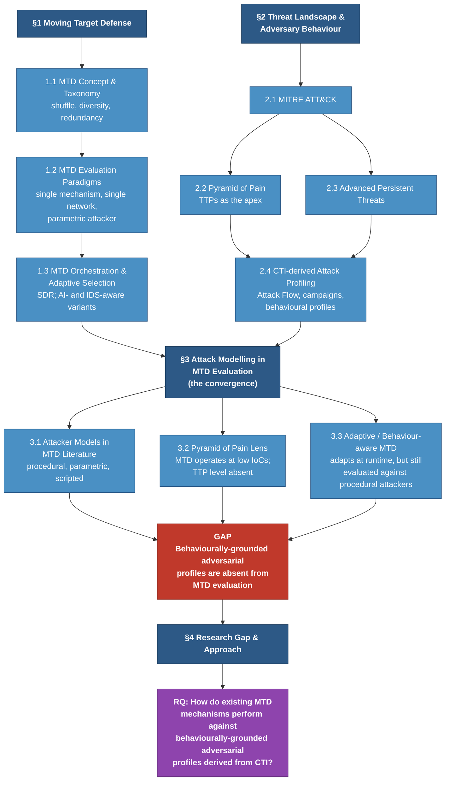

# Literature Review Plan — v2

**Project:** Adaptive MTD for Dynamic Networks — Marc Labouchardiere (23857377)
**Supervisor:** Dr Jin B. Hong (UWA, CSSE)
**Unit:** CITS4010 / 24-point research project
**Specification:** 5,000–6,000 words excluding references and AI-use statement; 10–20 references; IEEE referencing style
**Deadline:** 22 May 2026 (W12)
**Last revised:** 29 April 2026
**Supersedes:** `2026-04-16_MTDSim_LiteratureReviewPlan.md`

> **Revision note (29 April 2026):** Structure collapsed from four substantive sections + two RQs to three substantive sections + one synthesis section + one RQ. The previous §4 (IDS Fundamentals + MTD+IDS Integration) is folded into §1.3 as one example of observation-driven adaptive MTD orchestration. The two-gap argument is consolidated into one: behaviourally-grounded attacker fidelity is absent from MTD evaluation, including from the adaptive frontier. This reflects (a) Jin's 16 April steer to broaden RQ2 beyond IDS-specifics, and (b) the recognition that the previous structure conflated lit-review gap-identification with methodology design choices.

---

## Concept diagram

---

## §1 Moving Target Defense (~1,200–1,400 words)

**Narrative arc:** Define MTD and situate it as a paradigm. Characterise the dominant evaluation paradigm in the field (single mechanism, single network, parametric attacker). Introduce orchestration and adaptive variants — including IDS-aware and AI-driven adaptive MTD — as the field's response to the limits of single-mechanism deployment. Set up the question: as the field has moved toward orchestration and adaptation, has the *attacker* model in evaluation kept pace?

### 1.1 MTD Concept & Taxonomy (~350–400 words)

**Goal:** Define MTD; place it within proactive defence; establish the SDR taxonomy.

**Key points:**
- MTD as a paradigm shift from static to dynamic defence surfaces; foundational motivation
- Three-category taxonomy: shuffle, diversity, redundancy
- Defence layers: network (IP, topology, port), application (OS, services), reserve (users)
- Where MTD claims to operate (the implicit promise: increase attacker uncertainty across the kill chain)

**References to find:**
- [ ] Seminal MTD definition (foundational)
- [ ] MTD taxonomy / survey (Cho et al. 2020 IEEE Comm. Surveys & Tutorials is the canonical recent survey)

**Notes:**

### 1.2 MTD Evaluation Paradigms (~400–450 words)

**Goal:** Characterise *how* MTD has been evaluated — the standard pattern Jin has flagged repeatedly.

**Key points:**
- Typical evaluation setup: one MTD mechanism, one network topology, parametric or scripted attacker, optimise some metric (MTTC, ASR, RoA)
- Game-theoretic and Markov-based formal analysis as one branch
- Discrete-event simulation as another
- Limitation: the attacker is treated as a knob, not a model — `attacker_success` rates, fixed phase durations, no behavioural variability
- The narrowness of the evaluation paradigm is itself the launching point

**References to find:**
- [ ] Representative foundational MTD evaluation paper(s) — single-mechanism, single-network style
- [ ] Game-theoretic or Markov-based MTD evaluation paper

**Notes:**

### 1.3 MTD Orchestration & Adaptive Selection (~450–550 words)

**Goal:** The field's response to single-mechanism limits — orchestration (SDR scheduling) and adaptive selection (AI-driven, IDS-aware, observation-driven).

**Key points:**
- Simultaneous, alternative, random scheduling of multiple MTD techniques (Zhang et al.)
- Resource contention across defence layers
- AI-driven MTD selection: RL agents that pick *what* and *when* to deploy (Tay 2024, Ho 2024 in the UWA lineage; broader literature)
- Observation-driven adaptation: IDS/NIDS as input signals to the MTD selection policy (He et al. 2025; broader IDS+MTD integration literature)
- The frontier has moved toward adaptation, but adaptation against *what*?

**References to find:**
- [ ] SDR / MTD orchestration paper (Zhang et al. or equivalent)
- [ ] AI-driven adaptive MTD (Tay 2024, Ho 2024 are direct lineage; one external comparison)
- [ ] Observation-driven / IDS-aware adaptive MTD (He et al. 2025; one earlier framing paper)
- [ ] Comprehensive recent survey if available (Zhang et al. 2025 "MTD Meets AI-Driven Network" is on the candidate list)

**Notes:**

---

## §2 Threat Landscape & Adversary Behaviour (~1,200–1,400 words)

**Narrative arc:** Introduce the frameworks and concepts that structure how the security community now understands threats — MITRE ATT&CK as the de facto knowledge base, Pyramid of Pain as the conceptual hierarchy that places TTPs at the apex, APTs as the threat class for which behavioural fidelity matters most, and attack profiling approaches that translate raw CTI into structured adversary representations. By the end of this section the reader should believe that behavioural-fidelity attacker modelling is both possible and necessary in 2026.

### 2.1 MITRE ATT&CK Framework (~280–320 words)

**Goal:** Present ATT&CK as the de facto adversary behaviour knowledge base.

**Key points:**
- Structure: tactics (14), techniques (~600+), sub-techniques, procedures
- Data assets: campaigns (C0001–C0070+), groups, software, STIX format
- Attack Flow corpus (CTID) as a curated layer over ATT&CK adding structure (sequencing, dependencies)
- Industry and academic uptake

**References to find:**
- [ ] MITRE ATT&CK primary reference (Strom et al.) or recent ATT&CK-focused survey

**Notes:**

### 2.2 Pyramid of Pain (~250–300 words)

**Goal:** Establish the indicator hierarchy and why TTPs are the apex.

**Key points:**
- Six levels: hash → IP → domain → network/host artefact → tools → TTPs
- Defender cost vs attacker cost to change at each level
- TTPs are most stable: even with GenAI accelerating tooling/malware production, attacker tactics tied to motivation remain durable
- The argument that MTD's defensive value scales with the level it disrupts

**References to find:**
- [ ] Bianco — Pyramid of Pain (2013/2014) — foundational
- [ ] Recent paper applying Pyramid of Pain to defensive evaluation, if available

**Notes:**

### 2.3 Advanced Persistent Threats (~280–320 words)

**Goal:** Define the threat class for which behavioural fidelity matters most.

**Key points:**
- APT characteristics: targeted, resourced, multi-phase, persistent, adaptive
- Lifecycle alignment with MITRE tactics (recon → initial access → … → impact)
- Examples worth naming: APT29 / Cozy Bear, Lazarus, Volt Typhoon — campaigns spanning 50+ techniques
- Why APTs (not commodity attackers) are the right adversary class for MTD evaluation: motivation persistence makes behavioural modelling tractable

**References to find:**
- [ ] APT survey (Alshamrani et al. 2019 IEEE Comm. Surveys & Tutorials is the canonical one)
- [ ] One more recent APT paper for currency (2024–2026)

**Notes:**

### 2.4 CTI-derived Attack Profiling (~400–460 words)

**Goal:** Survey how behaviour is extracted from CTI into structured representations — the closest existing work to what MTD evaluation would need.

**Key points:**
- Behavioural profiling approaches: kill-chain templating, capability-based, campaign-driven
- Co-occurrence and dependency mining (Rahman 2022 — FP-Growth on technique sets)
- Attack-graph construction from CTI (manual and automated)
- Attack Flow grammar as a structured representation
- Threat-intelligence fusion (Zang et al. 2023 attack scenario reconstruction)
- Where this work *lives*: threat-intelligence and incident-response literature, not MTD literature — which is precisely the gap §3 will name

**References to find:**
- [ ] Co-occurrence / dependency mining (Rahman 2022)
- [ ] CTI fusion / attack scenario reconstruction (Zang et al. 2023)
- [ ] Attack Flow / structured CTI representation paper (CTID materials or equivalent)

**Notes:**

---

## §3 Attack Modelling in MTD Evaluation (the convergence) (~1,600–1,800 words)

**Narrative arc:** Bring §1 and §2 together. Apply the Pyramid of Pain lens (§2.2) to existing MTD evaluation (§1.2). Show that procedural attackers persist even into the adaptive/observation-driven frontier (§1.3, §3.3). Land the gap: behaviourally-grounded attacker fidelity, available in CTI literature (§2.4), has not made it into MTD evaluation — at any generation.

### 3.1 Attacker Models in MTD Literature (~500–600 words)

**Goal:** Critique the dominant attacker representation.

**Key points:**
- Typical model: uniform attacker, fixed scan/exploit durations, no profile differentiation
- Single-phase or short-cycle attack progression (scan → exploit → done; or 5–6 fixed phases)
- No campaign awareness, no tactic-level capability variation, no motivation
- Consequence: MTD effectiveness is measured against a generic, behaviourally-shallow adversary
- Direct lineage to your work: Brown's MTDSim attacker; Tay/Ho carry forward the same parametric attacker as their RL training environment
- Cite to critique, not to dismiss — these models served their purpose in establishing the simulator paradigm

**References to find:**
- [ ] 2–3 MTD papers using procedural / parametric attacker models (cite to critique)
- [ ] Tay 2024 thesis (direct UWA lineage)
- [ ] Ho 2024 thesis (direct UWA lineage)

**Notes:**

### 3.2 Pyramid of Pain Lens on MTD (~400–500 words)

**Goal:** Apply §2.2 to §1.2 and show the level mismatch.

**Key points:**
- IP shuffle, port shuffle → operates at hash/IP/domain pyramid levels
- OS diversity, service diversity → operates at tool/artefact level
- The defensive techniques themselves *can* operate higher up the pyramid (forcing tactic-changes), but the *evaluation* of those techniques uses attackers modelled at the bottom
- Therefore: even when MTD claims to disrupt at the TTP level, the empirical case for that claim is weak
- This is a structural problem, not a bug in any particular paper

**References to find:**
- [ ] Pyramid of Pain referenced again (already cited in §2.2)
- [ ] Any paper that explicitly maps MTD techniques to pyramid levels, if one exists

**Notes:**

### 3.3 Adaptive / Behaviour-aware MTD (~500–600 words)

**Goal:** Show that the gap persists even at the adaptive/observation-driven frontier introduced in §1.3.

**Key points:**
- AI-driven adaptive MTD (Tay, Ho, broader RL-MTD literature) — the agent adapts, but is *trained against* procedural attackers, so it learns to defeat procedural attackers
- IDS-aware / observation-driven adaptive MTD (He et al. 2025) — adaptation hooks exist for richer attacker signals, but evaluation still uses procedural baselines
- Why this matters: the field is investing in adaptation, but if the evaluation surface stays flat, adaptive MTD risks being optimised against a strawman
- **Gap statement:** Behaviourally-grounded adversarial profiles, available from CTI literature (§2.4), are absent from MTD evaluation across all evaluation generations — single-mechanism, orchestrated, AI-adaptive, and observation-driven

**References to find:**
- [ ] 1 adaptive / observation-driven MTD paper not already cited in §1.3 (for breadth)
- [ ] Any paper that discusses limitations of attacker realism in MTD evaluation (rare, but worth searching)

**Notes:**

---

## §4 Research Gap & Approach (~500–700 words)

**Narrative arc:** Synthesise the gap; state approach at a high level (without dropping into methodology); land the RQ.

### 4.1 Gap synthesis (~250–300 words)

**Key points:**
- The MTD evaluation paradigm has evolved (§1.2 → §1.3) but the attacker model has not
- The CTI / threat-intelligence community has tools for behavioural profiling (§2.4) — these have not been applied to MTD evaluation
- The Pyramid of Pain (§2.2) makes the level-mismatch concrete: MTD evaluation operates at the bottom of the pyramid, but MTD's claimed value is at the top
- Net: there is no published evaluation of MTD mechanisms against attackers modelled at TTP / behavioural fidelity

**Notes:**

### 4.2 Approach (~150–200 words)

> **Keep this brief and high-level.** The lit review is not the methodology chapter. The reader should understand *what* the work does (evaluate MTD against CTI-derived behavioural profiles in a network-agnostic simulator) without needing the specifics of GAP construction, motivation subgraphing, or Petri-net formalism — those are dissertation chapter 3.

**Key points:**
- Construct behavioural attacker profiles from CTI (MITRE ATT&CK Campaigns, Attack Flow corpus)
- Operationalise these profiles inside an existing simulation substrate (MTDSim) that supports multiple MTD mechanisms (SDR family) and is network-configuration-agnostic
- Compare effectiveness against procedural-attacker baselines from prior work

**Notes:**

### 4.3 Research question (~100 words)

**RQ:** *How do existing MTD mechanisms perform against behaviourally-grounded adversarial profiles derived from CTI?*

> **Pending:** Wording may sharpen to a comparative form pending Jin sign-off — e.g. "How does the effectiveness of existing MTD mechanisms differ when evaluated against behaviourally-grounded vs procedural attacker profiles?"

**Notes:**

---

## Reference tracker

> Target band: 10–20 references for a 24-point project. Working aim: 13–16 high-quality references (Q1/Q2 venues, 2025–2026 for state-of-the-art, foundational/canonical for definitions).

| # | Reference (placeholder) | Section | Status |
|---|---|---|---|
| 1 | MTD seminal definition | 1.1 | ☐ |
| 2 | MTD taxonomy / survey (Cho et al. 2020) | 1.1 | ☐ |
| 3 | Foundational MTD evaluation (single mechanism) | 1.2 | ☐ |
| 4 | Game-theoretic / Markov MTD evaluation | 1.2 | ☐ |
| 5 | SDR / orchestration (Zhang et al.) | 1.3 | ☐ |
| 6 | AI-driven adaptive MTD — UWA lineage (Tay 2024) | 1.3 / 3.1 | ☐ |
| 7 | AI-driven adaptive MTD — UWA lineage (Ho 2024) | 1.3 / 3.1 | ☐ |
| 8 | Recent MTD+AI survey (Zhang et al. 2025) | 1.3 | ☐ |
| 9 | IDS-aware adaptive MTD (He et al. 2025) | 1.3 / 3.3 | ☐ |
| 10 | MITRE ATT&CK foundational | 2.1 | ☐ |
| 11 | Bianco — Pyramid of Pain | 2.2 / 3.2 | ☐ |
| 12 | APT survey (Alshamrani et al. 2019) | 2.3 | ☐ |
| 13 | Co-occurrence / dependency mining (Rahman 2022) | 2.4 | ☐ |
| 14 | CTI fusion / scenario reconstruction (Zang et al. 2023) | 2.4 | ☐ |
| 15 | Attack Flow / structured CTI | 2.4 | ☐ |
| 16 | Procedural-attacker MTD critique exemplar | 3.1 | ☐ |
| 17 | (spare for late finds) | — | ☐ |

**Hard rule (per Jin's recency steer):** Any state-of-the-art reference must be 2025–2026 unless it is foundational or canonical (in which case publication date is irrelevant). Q1 preferred; Q2 acceptable; Q3+ only if there is no Q1/Q2 equivalent and the source is genuinely necessary.

---

## Word budget

| Section | Target | Drafted | Status |
|---|---|---|---|
| §1 Moving Target Defense | 1,200–1,400 | 0 | ☐ |
| §2 Threat Landscape & Adversary Behaviour | 1,200–1,400 | 0 | ☐ |
| §3 Attack Modelling in MTD Evaluation | 1,600–1,800 | 0 | ☐ |
| §4 Research Gap & Approach | 500–700 | 0 | ☐ |
| References (excluded from word count) | — | — | ☐ |
| AI-use statement (excluded from word count) | — | — | ☐ |
| **Total (excl. refs and AI statement)** | **4,500–5,300** | **0** | ☐ |

> Lower bound (~4,500) leaves buffer for §3 expansion if the gap argument needs more development. Upper bound stays comfortably inside the 6,000-word ceiling. The 10% penalty band starts at 6,600 words.

---

## Phase plan (29 April → 22 May)

**Phase 1 — Anchor scope (W9, ~3 days from 29 Apr).** Lock structure with Jin: this plan + RQ + collapsed diagram. Until structure is signed off, do not read deeply.

**Phase 2 — Seed reading list (W9–W10, ~3 days).** Pull bibliographies from Tay 2024, Ho 2024, Zhang (UWA), Dunstall (BACS). Pull the candidate papers from the 26 March meeting (Zhang 2025, Zang 2026, Rashid & Such 2025, Kim 2026, He 2025). Run Connected Papers on 2–3 anchors (Cho 2020, Tay 2024, Zhang 2025). Cull to ~25–30 candidates.

**Phase 3 — Triage & screen (W10, ~2 days).** Abstract + intro + conclusion screen. Tag survivors by section. Land on 13–16 papers to read in full.

**Phase 4 — Deep read & note (W10–W11, ~1.5 weeks).** Per-paper note files with the agreed schema. Build claim → evidence table as you go.

**Phase 5 — Draft (W11, ~1 week).** Section by section, prose-first. Front-load §3 and §4 (the gap and the argument).

**Phase 6 — Iterate (W12, ~5 days).** Draft to Jin early W12 (he flagged W12 feedback explicitly). Polish references to IEEE style. Write AI-use statement (re-use the proposal version, update for current scope). Final cross-check: every claim cited, every citation appears in text, no orphans.

---

## Open decisions to lock with Jin (mirrors `current_state.md`)

1. Sign off on this collapsed structure (single RQ, three substantive sections, IDS folded into §1.3).
2. Lock RQ wording — descriptive vs comparative form.
3. Confirm whether sub-questions are wanted (default: no).
4. Lock contribution claim wording for §4.
